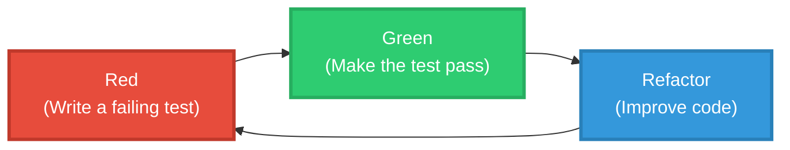

# テスト中心主義(1)

[:contents]

## 概要

この記事では、ソフトウェア開発におけるテスト駆動開発(Test-Driven Development: TDD)の考え方を一般化し、概念・命題・理論をテストによって理解する枠組みを提案する。

TDDでは、プログラムの仕様をテストによって記述し、そのテストに対する振る舞いによってプログラムの正しさを判断する。この考え方はソフトウェア開発に限らず、より一般的な認識の枠組みとして捉えることができる。

哲学においても、これに近い考え方が存在する。プラグマティズムでは、パースが観念の意味をその実践的帰結によって明らかにするべきであると主張した。また科学哲学では、ポパーが科学理論の条件として反証可能性を提案し、理論は観測によって誤りである可能性を持たなければならないとした。

この記事ではこれらの考え方を統一的に捉え、対象をテストによって理解する立場を**テスト中心主義(Test-centrism)** と呼ぶ。

テスト中心主義では、テストは順序をもつ有限列として扱われ、各テストは

- 入力
- 観測値(存在する場合)または未定義(オープン)

から構成される。

この枠組みにおいて、テストに関する次の二つの関係を区別する。

- **識別可能性**: テストの入力に対して対象の振る舞いが定義されること
- **検証可能性**: 対象の振る舞いと観測結果を比較できること

これらは対象の種類(概念・命題・理論)とは独立に定義される。したがって本稿では、あらゆる対象に対して識別と検証の両方を統一的に扱う。

さらに、対象の意味はテスト列に制限された振る舞いとして定義される。またこの枠組みによって、理解やリファクタリングといった概念も同一の構造のもとで形式化できることを示す。

## 1. はじめに

この記事では、テスト駆動開発(Test-Driven Development: TDD)の考え方を一般化し、概念・命題・理論を理解するための枠組みとしての**テスト中心主義(Test-centrism)** を提案する。

TDDでは、ソフトウェアの仕様をテストによって記述し、テストを通じてプログラムの振る舞いを定義する。この考え方はソフトウェア開発に限らず、より広い範囲に適用できる。

哲学においても、似た考え方が存在する。プラグマティズムでは、C.S.パースが**観念の意味はその実践的帰結にある**と述べた。また科学哲学では、サー・カール・ポパーが**科学理論は反証可能でなければならない**と主張した。

これらの立場は対象こそ異なるが、共通して次の考えを含んでいる。

```bash
コードにせよ観念にせよ理論にせよ、
すべての対象は、それを区別するテストによって理解される。
```

この記事ではこの考えを一般化し、

- 概念
- 命題
- 理論

のすべてに適用できる枠組みとして**テスト中心主義**を提示する。

## 2. TDD

### 2.1 テスト駆動開発

テスト駆動開発(Test-Driven Development: TDD)はソフトウェア開発の手法の一つである。通常の開発プロセスは「仕様 → 実装 → テスト」であるのに対して、TDDでは順序を逆転させる。つまり、「仕様 → テスト → 実装」として、テストを先に書く。

TDDの基本原則は次の通りである。

> - 自動化されたテストが失敗したときのみ、新しいコードを書く。
> - 重複を除去する。
>
> ベック『テスト駆動開発』ixページ

1つ目の原則は言い換えれば、**テストが失敗するまで実装しない**ということである。

TDDの有名なマントラは「Red → Green → Refactor」である(前掲xページ)。



1. Red : テストを書く(失敗する)
2. Green : 最小の実装で成功させる
3. Refactor : 振る舞いを変えずにコードを改善する

TDDの重要な特徴は**仕様をテストで記述する**という点にある。そうすることで、まず**何を**実現したいかを明確にして、その後で**どうやって**実現するかを考えることができるようになる。

Martin Fowlerは次のように述べている。

> テストを書くことで、機能を追加するためにすべきことは何かを自問することになります。また、テストを書くことで、実装よりもインタフェースに集中することになります(これは常によいことです)。コーディングが完了する時点も明確になります。それは、テストがうまくいったときです。
>
> 『リファクタリング』第2版 p.91

また、FreemanとPryceは次のように述べている。

> 第一に、テストから先に書き始めるということは、まず**何を**実現したいかを記述し、その後で**どうやって**実現するかを考えるということだ。「何を」に集中することで、対象となるオブジェクトの抽象度を正しいレベルに保てるようになる。もしユニットテストの意図がはっきりしていないとしたら、それは複数の概念を混同しているからだろう。そうだするれば、コーディングを始める準備ができていないことになる。また、テストから先に書き始めれば、情報隠蔽もやりやすくなる。オブジェクトの外部から見えるようにすべきなのは何かを決めなければならないからだ。
>
> p.61 『実践テスト駆動開発』

### 2.2 リファクタリング

Martin Fowlerの『リファクタリング』ではリファクタリングを次のように定義している。

> リファクタリング（名詞）
外部から見たときの振る舞いを保ちつつ、理解や修正が簡単になるように(to make it easier to understand and cheaper to modify)、ソフトウェアの内部構造を変化させること。
>
> 『リファクタリング』第2版 p.45

つまり、リファクタリングとは「振る舞いは変えない。内部構造だけを変えて、より理解しやすくする」変換である。

重要なのは**テストによって振る舞いの同一性が保証される**ことである。

テストが成功する限り、プログラムは**同値**と見なされる。

### 2.3 テストとは何か

『The art of software testing』ではテストを次のように定義している。

> Testing is the process of executing a program with the intent of finding errors.(テストとはエラーを見つけるつもりでプログラムを実行する過程である。)
>
> The art of software testing p.6

つまり、テストとは「エラーを見つける目的でプログラムを実行する過程」のことである。

### 2.4 TDD開発の例

テスト駆動開発の例として最大公約数のプログラムを考える。つまり、

```bash
与えられた任意の2つの自然数a, bに対して、
その最大公約数gcd(greatest common divisor)を取得する。

入力: a, b
出力: gcd
```

を考える。

最大公約数を求めるアルゴリズムはいくつもある。最も有名なのがユークリッドの互除法と呼ばれるものであるが、単純な割り算探索(brute-force)もある。

ここでは テスト駆動開発の手順に従ってプログラムを構築する。

#### 2.4.1 STEP 1 — 最初のテスト

TDDではまずテストを書くことから始める。最初のテスト $X_1$ を

- 入力:

$$
i_1 = (1, 1)
$$

- 期待値:

$$
o_1 = 1
$$

とする。すなわちテスト

$$
X_1 = (i_1,\, o_1) = ((1, 1), 1)
$$

を作る。

```python
# `tests/tdd_gcd_tutorial/gcd1/test_1.py`
from src.tdd_gcd_tutorial.gcd1 import gcd1

def test_t1():
    assert gcd1(1, 1) == 1
```

次に、このテストを通す最小の実装を書く。

```python
# `src/tdd_gcd_tutorial/gcd1.py`
def gcd1(a: int, b: int) -> int:
    # Return 1.
    return 1
```

テスト $X_1$ は**成功**する。

`1`を戻す自明な実装なので、リファクタリングは不要である。

#### 2.4.2 STEP 2 — テスト追加

次のテスト $X_2$ を追加する。

- 入力:

$$
i_2 = (3, 1)
$$

- 期待値:

$$
o_2 = 1
$$

すなわちテスト

$$
X_2 = (i_2,\, o_2) = ((3, 1), 1)
$$

である。このとき、 $gcd1(i_2) = o_2 = 1$ であるので、`gcd1`は $X_1, X_2$ の両方で**成功**する。したがって、**実装は変更しない。**

#### 2.4.3 STEP 3 — 失敗するテスト

次に

$$
X_3 = (i_3, o_3) = ((24, 8), 8)
$$

を追加する。

このとき、

$$
gcd1(i_3) = 1 \neq 8 = o_3
$$

である。よって、テスト $X_3$ は**失敗**する。

```bash
FAILED tests/tdd_gcd_tutorial/gcd1/test_3.py::test_t3 - assert 1 == 8
```

TDDでは「失敗したテストを通す最小の実装を追加する」ので、次の実装を作る。

```python
# src/tdd_gcd_tutorial/gcd2.py
def gcd2(a: int, b: int) -> int:
    # Return the smaller number of a and b.
    return b
```

`gcd2`はテスト

$$
X_1, X_2, X_3
$$

すべて**成功**する。

#### 2.4.4 STEP 4 — 入力順序の問題

次のテストを追加する。

$$
X_4 = (i_4, o_4) = ((8, 24), 8)
$$

を追加する。

このとき、`gcd2`は $gcd2(i_4) \neq o_4$ となり**失敗**する。

```bash
FAILED tests/tdd_gcd_tutorial/gcd2/test_4.py::test_t4 - assert 24 == 8
```

そこで、次の実装を作る。

```python
def gcd3(a: int, b: int) -> int:
    # Return the smaller number of a and b.
    c = b
    if a < b:
        c = a
    return c
```

`gcd3`はテスト

$$
X_1, \dots,X_4
$$

すべて**成功**する。

この実装は少し冗長であり、メソッド`min`を使うほうがわかりやすいので、次のようにリファクタリングする。

```python
# src/tdd_gcd_tutorial/gcd3.py
def gcd3(a: int, b: int) -> int:
    # Return the smaller number of a and b.
    return min(a, b)
```

この実装はテストに成功する。

#### 2.4.5 STEP 5 — 一度では割り切れない場合

次のテストを追加する。

$$
X_5 = (i_5, o_5) = ((24, 16), 8)
$$

を考える。

このとき、`gcd3`は $gcd3(i_5)\neq o_5$ となり**失敗**する。

```python
FAILED tests/tdd_gcd_tutorial/gcd3/test_5.py::test_t5 - assert 16 == 8
```

そこでユークリッドの互除法のそこでユークリッドの互除法の1ステップだけを行う実装を書く。

```python
# src/tdd_gcd_tutorial/gcd4.py
def gcd4(a: int, b: int) -> int:
    # One step of the Euclidean algorithm.
    # Replace the smaller number with the remainder.
    x = max(a, b)
    y = min(a, b)
    r = x % y
    if r:
        y = r
    return y
```

`gcd4`はテスト

$$
X_1, \dots,X_5
$$

すべて**成功**する。

この実装は少し冗長であるので、次のようにリファクタリングする。

```python
def gcd4(a: int, b: int) -> int:
    # One step of the Euclidean algorithm.
    # Replace the smaller number with the remainder.
    a, b = max(a, b), min(a, b)
    return a % b if a % b else b
```

この実装はテストに成功する。

#### 2.4.6 STEP 6 — 互いに素

最後に

$$
X_6 = (i_6, o_6) = ((24, 7), 1)
$$

を追加する。

このとき、`gcd4`は $gcd4(i_6)\neq o_6$ となり**失敗**する。

```python
FAILED tests/tdd_gcd_tutorial/gcd4/test_6.py::test_t6 - assert 3 == 1
```

そこで ユークリッドの互除法を完全に実装する。

```python
# src/tdd_gcd_tutorial/gcd5.py
def gcd5(a: int, b: int) -> int:
    # Straightforward Euclidean algorithm. Time complexity: O(log n).
    while True:
        if b == 0:
            return a
        else:
            r = a % b
            a = b
            b = r
```

`gcd5`はテスト

$$
X_1, \dots,X_6
$$

すべて**成功**する。

これでユークリッドの互除法のプログラムが完成した。

`gcd5`はユークリッドの互除法のプログラムの1つであるが、少し複雑である。そこで例えば、以下の`gcd6`と`gcd7`のような実装は`gcd5`と同様にすべてのテストに成功する。

```python
# src/tdd_gcd_tutorial/gcd6.py
def gcd6(a: int, b: int) -> int:
    # Overly short Euclidean algorithm. Time complexity: O(log n).
    return a if b == 0 else gcd6(b, a % b)

# src/tdd_gcd_tutorial/gcd7.py
def gcd7(a: int, b: int) -> int:
    # Human-readable Euclidean algorithm. Time complexity: O(log n).
    while b !=0 :
        a, b = b, a % b
    return a
```

さらに次の`gcd8`は単純な割り算探索(brute-force)の例である。

```python
def gcd8(a: int, b: int) -> int:
    # Naive division search (brute-force). Time complexity: O(n).
    m = min(a, b)
    for i in range(m, 0, -1):
        if a % i == 0 and b % i == 0:
            return i
```

これらはリファクタリングの候補である。しかしそれぞれに特徴がある。`gcd6`は簡潔しすぎて人間にわかりづらい。`gcd8`は計算量が`gcd5`と異なる。よって、最も適切なリファクタリングは`gcd7`である。

## 3. プラグマティズムの格率

プラグマティズムの創始者パースは、観念の意味について次のように述べている。

> 我々が持つ概念の対象は何らかの効果を及ぼすと、我々が考えているとして、もしその効果が行動に対しても実際に影響を及ぼしうると想定されるなら、それはいかなる効果であるか、しかと吟味せよ。この吟味によって得られる、こうした効果について我々が持つ概念こそ、当の対象について我々が持つ概念のすべてをなしている。
>
> CP 5.402

この主張は**プラグマティズムの格率(Pragmatic Maxim)** と呼ばれる。これは科学的探究において必要な論理学的な原理であるとパースは主張する(どこかにあった。引用箇所を調べる必要がある。もしかしたらそう述べていたのはアブダクションのことだったかもしれない)。この格率は次のように言い換えることができる。

```bash
観念の意味はそれが生む観測可能な結果にある
```

つまり、ある概念を理解するとは、その概念がどのような状況でどのような結果を生むかを知ることである。

例えば「硬い」という概念を考える(CP 5.403 CP 5.467)。この概念の意味は

- 叩くと音がする
- 押しても変形しない
- ナイフで傷がつきにくい

といった**観測可能な結果**によって明らかになる。

つまり、概念の意味は、それを区別するテストによって理解される。

## 4. 反証可能性

ポパーは科学理論の条件として**反証可能性(falsifiability)** を提案した。ポパーによれば、科学理論とは

```bash
観測によって誤りである可能性がある理論
```

である。

例えば次の全称命題を考える。

```bash
すべての白鳥は白い
```

この命題は、黒い白鳥が観測されれば反証される。

つまり、いくつかの全称命題の体系である科学理論とは

```bash
ある観測が起これば
誤りであることが示される理論
```

である。

この意味で、科学理論は常に**テスト可能な予測**を含んでいる。

## 5. テスト中心主義の定式化へ向けてのいくつかの例

### 5.1 最大公約数

[TDD開発の例](#24-tdd開発の例)で示した最大公約数のプログラム`gcd1`から`gcd8`について考えてみよう。

#### 5.1.1 振る舞い関数

`gcd`は自然数のペアを入力として受け取り、自然数を出力する関数である。すなわち、**入力集合**を $I$ 、**出力集合**を $O$ とすると、

$$
\begin{align*}
I &= \mathbb{N}^2 \\
O &= \mathbb{N}
\end{align*}
$$

である。`gcd`は入力値 $i \in I$ に対して、出力

$$
gcd(i) \in O
$$

が存在する。そこで、`gcd`の**振る舞い関数(behavioral function)** を

$$
\text{behavior}_{gcd}: I \to O
$$

で定義する。

例えば、`gcd1`の振る舞い関数 $\text{behavior}_{gcd1}$ に対して、テスト $X_1$の入力 $i_1$ を与えると、

$$
\text{behavior}_{gcd1}(i_1) = 1
$$

となる。これは

```bash
入力に対して応答できる
```

を意味する。

#### 5.1.2 テスト

TDDでは通常、各テストに期待値(expected value)が与えられる。しかし実際には、期待値が事前に分からない場合も存在する。そこでここではテストを次の2種類に分類する。

- 観測テスト(Observed test)
- オープンテスト(Open test)

**観測テスト**とは、入力とそれに対応する期待値が与えられているテストである。

$$
X_{ob} = (i, \, o) \in I \times O
$$

一方、**オープンテスト**とは期待値(観測値)が与えられていないテストである。ここでは期待値が未定であることを$\bot$で表す。

$$
X_{op} = (i, \, \bot) \in I \times \{\, \bot \,\}
$$

したがって、テストは

$$
X = (i, o) \in I \times (O \cup \{\bot\})
$$

である。

観測テスト $X_{ob} = (i, o)$ が与えられている場合、その期待値を取り除くことで対応するオープンテスト $X_{op}$

$$
(i,\, \bot)
$$

を構成できる。

#### 5.1.3 テスト列

一般的にテストには順序がある。そのため、テスト集合ではなく**テスト列**として扱う。テスト列 $\mathbb{X}$ とは、有限個のテストを順序つきで並べたものである。すなわち、

$$
\mathbb{X}=(X_1,X_2,\dots,X_n)
$$

である。ここで、 $X_j\in I\times (O\cup{\bot})$ である。例えば、次のようなテスト列を考える。

$$
\mathbb{X} = ((i_1,\, o_1),\, (i_2,\, o_2),\, (i_3,\, o_3),\, (i_4,\, \bot))
$$

このとき、1〜3番目は観測テストであり、4番目はオープンテストである。

`gcd`のテスト列 $\mathbb{X} = (X_1,\, X_2,\, X_3,\, X_4,\, X_5,\, X_6)$ を次のように定義する。

| テスト | 入力 $i$ | 出力 $o$ |
| --- | --------- | - |
| $X_1$ | (1, 1) | 1 |
| $X_2$ | (3, 1) | 1 |
| $X_3$ | (24, 8) | 8 |
| $X_4$ | (8, 24) | 8 |
| $X_5$ | (24, 16) | 8 |
| $X_6$ | (24, 7) | 1 |

#### 5.1.4 テスト結果

##### 5.1.4.1 識別

それぞれの`gcd`を実行すると、次の結果が出力される。

| | $i_1$: (a,b) = (1, 1) | $i_2$: (a,b) = (3, 1) | $i_3$: (a,b) = (24, 8) | $i_4$: (a,b) = (8, 24) | $i_5$: (a,b) = (24, 16) | $i_6$: (a,b) = (24, 7) |
| :-: | :-: | :-: | :-: | :-: | :-: | :-: |
| gcd1 | 1 | 1 | 1 | 1 | 1 | 1 |
| gcd2 | 1 | 1 | 8 | 24 | 16 | 7 |
| gcd3 | 1 | 3 | 8 | 8 | 16 | 7 |
| gcd4 | 1 | 1 | 8 | 8 | 8 | 3 |
| gcd5 | 1 | 1 | 8 | 1 | 8 | 1 |
| gcd6 | 1 | 1 | 8 | 1 | 8 | 1 |
| gcd7 | 1 | 1 | 8 | 1 | 8 | 1 |
| gcd8 | 1 | 1 | 8 | 1 | 8 | 1 |

ここから次のことがわかる。

1. `gcd5`と`gcd6`はテスト列 $\mathbb X$ に対して、同じ結果を出力するので、その振る舞いから区別することができない。このとき「`gcd5`はテスト列 $\mathbb X$ に対して`gcd6`と**識別同値(discriminative equivalent)** である」と呼ぼう。これは**振る舞い同値 (behavioral equivalent)** と呼んでもいい。同様に`gcd5`はテスト列 $\mathbb X$ に対して`gcd7`および`gcd8`とも識別同値である。
2. `gcd1`と`gcd2`はテスト $X_3$ においてそので出力結果が異なっているので、振る舞いから区別することができる。つまり、`gcd1`はテスト列 $\mathbb X$ に対して`gcd2`と識別同値ではない。同様に`gcd1`は`gcd3`、`gcd4`、`gcd5`とも識別同値ではない。

##### 3.1.4.2 検証

テストを実行すると次の結果になる。

| | $X_1$: $(i_1,\, o_1)$ = ((1, 1), 1) | $X_2$: $(i_2,\, o_2)$ = ((3, 1), 1) | $X_3$: $(i_3,\, o_3)$ = ((24, 8), 8) | $X_4$: $(i_4,\, o_4)$ = ((8, 24), 8) | $X_5$: $(i_5,\, o_5)$ = ((24, 16), 8) | $X_6$: $(i_6,\, o_6)$ = ((24, 7), 1) |
| :-: | :-: | :-: | :-: | :-: | :-: | :-: |
| gcd1 | True | True | False | False | False | True |
| gcd2 | True | True | True | False | False | False |
| gcd3 | True | True | True | True | False | False |
| gcd4 | True | True | True | True | True | False |
| gcd5 | True | True | True | True | True | True |
| gcd6 | True | True | True | True | True | True |
| gcd7 | True | True | True | True | True | True |
| gcd8 | True | True | True | True | True | True |

ここから次のことがわかる。

1. `gcd5`はテスト列 $\mathbb X$ に対して、すべてのテストで出力が期待値と一致している。このとき「`gcd5`はテスト列 $\mathbb X$ によって**検証されている(verified)** 」と呼ぼう。同様に`gcd6`かつ`gcd7`かつ`gcd8`もテスト列 $\mathbb X$ によって検証されている。
2. `gcd5`と`gcd6`はいずれもテスト列 $\mathbb X$ で検証されている。このとき「`gcd5`はテスト列 $\mathbb X$ に対して`gcd6`と**検証同値(verification equivalent)** である」と呼ぼう。これは**仕様同値(specification equivalent)** と呼んでもいい。同様に`gcd5`はテスト列 $\mathbb X$ に対して`gcd7`および`gcd8`とも検証同値である。
3. `gcd1`はテスト列 $\mathbb X$ に対して、少なくとも1つのテストで期待値と一致しない。例えば、`gcd1`はテスト $X_3$ において期待値と不一致(`False`)である。このとき「`gcd1`はテスト列 $\mathbb X$ によって**反証されている(falsified)** 」と呼ぼう。同様に`gcd2`かつ`gcd3`かつ`gcd4`はテスト列 $\mathbb X$ によって反証されている。
4. さらに前述の[識別](#5141-識別)と比較すると、`gcd` がテスト列 $\mathbb{X}$ に対して`gcd'` と検証同値であるならば、`gcd` は $\mathbb{X}$ に対して `gcd'` と識別同値であることがわかる。

### 5.2 プラグマティズムの例

「硬い」と「柔らかい」という概念を考える。これらの概念を理解するためには、次のようなテストを考えることができる。

- ナイフで引っかく

プラグマティズムの格率とは、次を満たす原理であるとみなせる。すなわち、概念の対象はテストによって**識別可能**であり、概念の意味とは、その概念がテストに対して示す振る舞いである。

```bash
意味 = テストが示す振る舞い
```

これらのテストの結果によって、「硬い」と「柔らかい」は概念として区別される。

つまり、

```bash
概念はそれを区別するテストによって理解される。
```

プラグマティズムの格率が直接述べているのは、概念が識別可能であることである。すなわち、その概念を用いることで、どのような状況でどのような違いが生じるかを区別できなければならないという点である。

ただし、この段階では実際に何が起こるかまではまだ確定していない。概念を用いることで「このような結果になるだろう」という予測が得られるが、その予測が正しいかどうかはまだ分からない。

その予測が正しいかどうかは、実験や観測によって確かめられる。ここで初めて、概念に基づく予測が検証される。

科学的探究において実験が不可欠であるのはこのためである。概念を実験によって検証するためには、まずその概念が識別可能であることが必要である。プラグマティズムの格率は、この識別可能性を概念の意味の条件として示しているのである。

### 5.3 科学理論の例

科学理論もまた、テストによって理解される対象である。例えば、次の命題 $P$ を考える。

```bash
すべての白鳥は白い
```

この命題は、白鳥を観測することによって調べることができる。例えば、次のようなテストを考える。

```bash
白鳥を観測し、その色を確認する
```

これまでおこなわれた観測の結果として、観測テスト列

$$
\mathbb X_n = (X_1,\,\dots,\,X_n)
$$

が得られているとする。ここで、各テスト $X_i$ は白鳥を観測し、その色を確認するものである。

これまで観測された白鳥がすべて白であれば、命題 $P$ は観測結果と矛盾しない。すなわち、命題 $P$ はテスト列 $\mathbb X_n$ によって検証されている。

次に、観測がさらに続けられる場合を考える。最初の $N-1$ 回は観測テストであり、$N$ 回目がオープンテストであるテスト列 $\mathbb{X}_N$

$$
\mathbb{X}_N = (X_1,\dots,\, X_n,\, X_{n + 1},\dots,\, X_{N - 1},\, X_N)
$$

を考えよう。ここで、$X_i \in I \times O\,(i = 1,\dots,N - 1)$ であり、$X_N \in I \times \{\bot\}$ である。

命題 $P$ はオープンテスト $X_N$ の入力 $i_N$ に対して次のような予測を与える。

$$
\text{behavior}_P(i_N) = \text{the swan}\, i_N\, \text{is white}
$$

もしこの観測において、白くない白鳥(例えば黒い白鳥)が観測された場合、

$$
\text{behavior}_P(i_N) \neq o_N
$$

となり、命題 $P$ はテスト列 $\mathbb{X}_N$ によって反証される。

このように科学理論は、観測によって反証される可能性を持つ。言い換えれば、科学理論はそれを反証する可能性のあるテストによって特徴づけられる。

```bash
理論はそれを反証する可能性のあるテストによって特徴づけられる
```

この意味で、科学理論は常にまだ観測されていない現象についての予測を含んでいる。

## 6. テスト中心主義

### 6.1 基本アイデア

対象を次の3種類に分類する。

- Concept
- Proposition
- Theory

テスト中心主義の基本的な立場は次の通りである。

```bash
対象はテストによって理解される
```

ここでいう「テスト」とは、対象に対して何らかの操作や観測を行い、その結果を得る手続きのことである。

概念の場合には、テストはその概念がどのような観測可能な結果をもたらすかを調べる操作である。

命題の場合には、テストはその命題が成立するかどうかを確認する観測である。

理論(命題の体系)の場合には、テストはその理論が与える予測を観測と比較する手続きである。

このように、概念・命題・理論はいずれも、テストによってその意味や内容が明らかになる。

### 6.2 テストの役割

テストには2つの役割がある。それは**構成のためのテスト**と**理解のためのテスト**である。

#### 6.2.1 構成のためのテスト

構成のためのテストとは、TDDでおこなわれるテストである。つまり、「仕様 → テスト → 実装」である。

#### 6.2.2 理解のためのテスト

理解のためのテストとは、ある対象(概念・命題・理論)を理解するためにおこなわれるテストである。つまり、「対象 → テスト → 振る舞い」である。「理論を理解する = それを区別するテストを作れる」ことである。

## 7. 定式化

テスト中心主義を形式化する。

### 公理1(対象)

対象の集合を

$$
\mathcal T
$$

とする。

対象 $T \in \mathcal{T}$ は次のいずれかの種類に属する。

- 概念(Concept)
- 命題(Proposition)
- 理論(Theory)

### 公理2(振る舞い関数)

入力集合 $I$ と出力集合 $O$ が存在する。

各対象

$$
T \in \mathcal{T}
$$

は振る舞い関数

$$
\text{behavior}_T : I \to O
$$

を持つ。

### 公理3(テスト)

対象 $T$ に対するテスト $X$ は

$$
(i,\,o) \in I \times (O \cup \{\bot\})
$$

である。ここで、

- $(i,\, o) \in I \times O$ を観測テスト(Observed test)
- $(i,\, \bot) \in I \times \{\bot\}$ をオープンテスト(Open test)

という。オープンテストは実際の観測が未確定であるテストを表す。

### 公理4(テスト列)

有限個のテストを順序つきで並べたテスト列 $\mathbb{X}$ という。

$$
\mathbb{X} = (X_1,\,\dots,X_n)
$$

ここで、各 $X_i$ はテストであり、

$$
X_i \in I \times (O \cup \{ \bot \})
$$

を満たす。

テスト列 $\mathbb{X}$ の入力集合を
$$
inputs(\mathbb{X}) = \{\, p_i: X_i \to I\, \text{is the projection}\mid X_i\in \mathbb{X} \,\}
$$

と定義する。

### 公理5(意味)

対象 $T$ のテスト列 $\mathbb{X}$ に関する**意味** $\text{Meaning}_\mathbb{X}(T)$ とは

$$
\text{Meaning}_\mathbb{X}(T) = (\text{behavior}_T(i_1),\dots,\text{behavior}_T(i_n))
$$

ここで $i_j \in inputs(\mathbb{X})$ である。

### 公理6(検証可能性)

テスト列 $\mathbb{X}$ **検証可能**であるとは、すべてのテスト $X_i \in \mathbb{X}$ が観測テストであることをいう。

### 公理7(識別同値性)

対象 $T,S \in \mathcal T$ がテスト列 $\mathbb{X}$ について**識別同値**であるとは

$$
\forall i \in inputs(\mathbb{X}) : \text{behavior}_T(i) = \text{behavior}_S(i)
$$

である。このとき、

$$
T \sim_{\mathbb{X}} S
$$

と書く。

これは

```bash
与えられたテスト列では区別できない
```

ことを意味する。

### 公理8(検証同値性)

対象 $T \in \mathcal T$ が検証可能なテスト列 $\mathbb{X}$ で**検証される**とは、

$$
T \vDash \mathbb{X}
$$

と書き，テスト列 $\mathbb{X}$ のすべてのテスト $X = (i,\, o)$ に対して、

$$
\mathrm{behavior}_T(i) = o
$$

である。

対象 $T,S \in \mathcal T$ がテスト列 $\mathbb{X}$ について**検証同値**であるとは

$$
T \vDash \mathbb{X}
\quad \land \quad
S \vDash \mathbb{X}
$$

である。このとき、

$$
T \approx_{\mathbb{X}} S
$$

と書く。

つまり

```text
両方とも与えられたテスト列をパスする
```

ことである。

対象 $T,S \in \mathcal T$ が検証同値ならば、識別同値である。つまり、

$$
T \approx_{\mathbb{X}} S
\Rightarrow
T \sim_{\mathbb{X}} S
$$

である。

### 公理9(理解)

主体が対象 $T \in \mathcal T$ をテスト列 $\mathbb{X}$ に関して**理解する**とは任意の入力 $i \in inputs(\mathbb{X})$ に対して、

$$
\text{behavior}_T(i)
$$

を予測(または決定)できる能力を持つことである。

```bash
理解 = テスト応答能力
```

### 公理10(複雑度)

対象の集合 $\mathcal{T}$ 上に複雑度関数

$$
C: \mathcal{T} \to \mathbb{R}_{\geq0}
$$

が定義される。

### 公理11(リファクタリング)

対象 $T,S \in \mathcal T$ に対して

$$
T \approx_{\mathbb{X}} S \land C(S) \le C(T)
$$

ならば、$S$ は $T$ の**リファクタリング**である。

## 8. 例

### 8.1 最大公約数: 検証可能な対象の例

`gcd`を命題とみなす。

- 対象の集合:

$$
\mathcal T_{\text{gcd}}
=
\{\,
\text{gcd1},\, \text{gcd2},\, \text{gcd3},\,\text{gcd4},\,
\text{gcd5},\, \text{gcd6},\, \text{gcd7},\, \text{gcd8}\,
\}
$$

- 検証可能なテスト列:

$$
\mathbb{X} = (X_1,\, X_2,\, X_3,\, X_4,\, X_5,\, X_6)
$$

各テストは

$$
X_k = (i_k,\,o_k)
$$

という形をとり

- 入力 $i_k = (i_{k_1},\,i_{k_2}) \in \mathbb{N}^2$
- 観測 $o_k \in \mathbb{N}$

を表す。

- 検証可能性:

すべての対象

$$
T \in \mathcal T_{\text{gcd}}
$$

はテスト列 $\mathbb{X}$ に対して検証可能である。

- 識別同値性:

$$
\begin{align*}
\text{gcd1} &\nsim_{\mathbb{X}} \text{gcd2} \\
\text{gcd1} &\nsim_{\mathbb{X}} \text{gcd3} \\
\text{gcd1} &\nsim_{\mathbb{X}} \text{gcd4} \\
\text{gcd1} &\nsim_{\mathbb{X}} \text{gcd5} \\
\text{gcd2} &\nsim_{\mathbb{X}} \text{gcd3} \\
\text{gcd2} &\nsim_{\mathbb{X}} \text{gcd4} \\
\text{gcd2} &\nsim_{\mathbb{X}} \text{gcd5} \\
\text{gcd3} &\nsim_{\mathbb{X}} \text{gcd4} \\
\text{gcd3} &\nsim_{\mathbb{X}} \text{gcd5} \\
\text{gcd5} &\sim_{\mathbb{X}} \text{gcd6} \\
\text{gcd5} &\sim_{\mathbb{X}} \text{gcd7} \\
\text{gcd5} &\sim_{\mathbb{X}} \text{gcd8} \\
\end{align*}
$$

- 検証同値性:

$$
\begin{align*}
\text{gcd1} &\not\approx_{\mathbb{X}} \text{gcd2} \\
\text{gcd1} &\not\approx_{\mathbb{X}} \text{gcd3} \\
\text{gcd1} &\not\approx_{\mathbb{X}} \text{gcd4} \\
\text{gcd1} &\not\approx_{\mathbb{X}} \text{gcd5} \\
\text{gcd2} &\not\approx_{\mathbb{X}} \text{gcd3} \\
\text{gcd2} &\not\approx_{\mathbb{X}} \text{gcd4} \\
\text{gcd2} &\not\approx_{\mathbb{X}} \text{gcd5} \\
\text{gcd3} &\not\approx_{\mathbb{X}} \text{gcd4} \\
\text{gcd3} &\not\approx_{\mathbb{X}} \text{gcd5} \\
\text{gcd5} &\approx_{\mathbb{X}} \text{gcd6} \\
\text{gcd5} &\approx_{\mathbb{X}} \text{gcd7} \\
\text{gcd5} &\approx_{\mathbb{X}} \text{gcd8} \\
\end{align*}
$$

- 意味:

$$
\begin{align*}
\text{Meaning}_\mathbb{X}[\text{gcd5}]
&= (\text{behavior}_\text{gcd5}(i_1),\dots,\text{behavior}_\text{gcd5}(i_6)) \\
&=
(1,\, 1,\, 8,\, 1,\, 8,\, 1)\\
&= \text{Meaning}_\mathbb{X}[\text{gcd6}] = \text{Meaning}_\mathbb{X}[\text{gcd7}] = \text{Meaning}_\mathbb{X}[\text{gcd8}]
\end{align*}
$$

つまり、`gcd5`、`gcd6`、`gcd7`、`gcd8`はテスト列に関して同じ意味をもつ。

- 理解:

主体が`gcd5`を理解するとは、任意の入力 $i \in inputs(\mathbb{X})$ に対して、

$$
\text{behavior}_{\text{gcd5}}(i)
$$

を予測できる能力を持つことである。

- リファクタリング:

`gcd5`から`gcd7`への操作はリファクタリングである。

$$
\text{gcd5} \to \text{gcd7}
$$

### 8.2 プラグマティズムの格率: 硬い

- 対象の集合:

$$
\mathcal T_{\text{hs}} = \{ \text{ hard }, \text{ soft } \}
$$

- テスト列:

$$
\mathbb{X} = ((\text{ knife-edge test},\, \bot))
$$

このテスト列はオープンテストのみである。

- 識別可能性(プラグマティズムの格率):

プラグマティズムの格率によれば、概念の意味はその概念がもたらす **想定される効果**によって与えられる。

「硬い」とはナイフの刃で引っかいたときの振る舞いで定義される。

$$
\begin{align*}
\text{behavior}_{\text{hard}}(\text{knife-edge test}) &= \text{resist} \\
\text{behavior}_{\text{soft}}(\text{knife-edge test}) &= \text{scratch}
\end{align*}
$$

- 識別同値性:

$$
\text{behavior}_{\text{hard}}(\text{knife-edge test})
=
\text{resist}
\neq
\text{scratch}
=
\text{behavior}_{\text{soft}}(\text{knife-edge test})
$$

したがって

$$
\text{hard} \nsim_{\mathbb{X}} \text{soft}
$$

となり、両者はこのオープンテストによって識別可能である。

- 意味:

$$
\begin{align*}
\text{Meaning}_\mathbb{X}[\text{hard}]
&=
(\text{behavior}_\text{hard}(\text{knife-edge test}))
= (\text{resist})
\\
\text{Meaning}_\mathbb{X}[\text{soft}]
&=
(\text{behavior}_\text{soft}(\text{knife-edge test}))
= (\text{scratch})
\end{align*}
$$

ここでは観測は導入されていない。したがってこれは **検証ではなく識別の例**である。

この例はプラグマティズムの格率「概念の意味はその概念の実践的効果によって決まる」をテスト中心主義の枠組みで表現したものである。

### 8.3 科学理論: 反証可能性

次に、科学理論を考える。

- 対象の集合:

$$
\mathcal T_{\text{swan}}
=
\{\, T \,
\}
$$

ここで、$T = \text{「すべての白鳥は白い」}$ という全称命題である。

- テスト列:

$$
\mathbb{X} = ((i_1,\,\text{white}),\, (i_2,\, \text{white}),\dots,(i_{n-1},\,\text{white}),\, (i_n,\,\bot))
$$

を`n-1`番目まで観測テストであり、`n`番目がオープンテストであるとする。ここでのテスト方法は

```bash
白鳥を観測し、その色を確認する
```

というものとする。

命題 $T$ はテスト列のすべての入力 $i\in inputs(\mathbb{X})$ に対して、

$$
\text{behavior}_T(i) = \text{white}
$$

を予測する。

- 検証可能性

`n`番目のオープンテストで観測 $o_n$ が出たとする。もし、

$$
o_n = \text{white}
$$

が成立すれば、テスト列 $\mathbb{X}$ のすべてのテストで $\text{behavior}_T(i) = o_i$ であるので、

$$
T \vDash \mathbb{X}
$$

となる。

このとき命題 $T$ はテスト $\mathbb{X}$ によって検証された。

- 反証可能性

もし、オープンテストの観測結果が

$$
o_n = \text{black}
$$

であるならば、

$$
\mathrm{behavior}_T(n_i)
\neq
o_n
$$

となる。

したがって

$$
T \not\vDash \mathbb{X}
$$

である。このとき命題 $T$ はテスト列 $\mathbb{X}$ よって反証される。

したがって、科学理論は

```bash
観測と一致しない結果が現れる可能性を持つ
```

という意味で反証可能である。

この構造はテスト中心主義では次のように表される。

```bash
反証 = behavior と observation の不一致
```

## 9. 結論

この記事では、対象をテストによって理解する立場として**テスト中心主義(Test-centrism)** を提案した。

テスト中心主義では、対象は入力に対する振る舞いとして与えられ、テストは入力と(存在する場合の)観測値からなる順序つきの有限列として定義される。このとき、テストに関して次の二つの基本関係が導入される。

- **識別可能性**: テストの入力に対して対象の振る舞いが定義されること
- **検証可能性**: 対象の振る舞いと観測結果を比較できること

この区別に基づき、基本概念は次のように定式化される。

- **意味**: テスト列に制限された振る舞い
- **識別同値性**: すべてのテスト入力に対する振る舞いの一致
- **検証同値性**: すべての観測テストをともに満たすこと
- **理解**: テスト列に対する応答を予測できる能力

またソフトウェア開発におけるリファクタリングは、この枠組みでは次のように理解できる。

- **リファクタリング**: 複雑性を減少させる検証同値性を保つ変換

このようにテスト中心主義は、

- ソフトウェア(プログラムの振る舞い)
- 科学理論(観測による検証)
- 哲学(概念の意味)

を共通の構造のもとで扱うことを可能にする。

したがって、テストという概念は単なるソフトウェア開発の技法ではなく、対象を理解するための一般的な方法論として捉えることができる。

## おわりに

これまで温めてきた考えをこの土日で一気に書き上げた。まだまだ曖昧だったり、明確でない箇所がたくさんあるが、まずは一通りできた。言いたいことはたくさんある。この記事を修正したり、この続きを書いたりしようと思う。

- ~~「テスト」「振る舞い」「観察」「観測」「識別」「検証」など用語がバラバラであり、また明確ではない。~~
- ~~[科学理論の例](#53-科学理論の例)は全然まだうまくいかなかった。また、[公理からの科学理論の例](#83-科学理論-反証可能性)との繋がりもほとんどない。ここは考え直して、書き直さなければならない。理論の反証可能性はテスト集合が増えることで、あるテストで反証が起こるというものではないかと思う。そのあたりを非形式的、形式的かかわらず、説明できるようにしたい。~~
- どうやらこの定式化は圏論として発展できるそうだ。
- ここでぐだぐだと定式化したことは、すでに誰かがやった二番煎じかもしれない。Dana ScottやRobin Milnerがおこなったことに近いかもしれないとAIに指摘された。しかし、別に全く気にしない。自分で考えるというのが一番大切なことだから。
- TDDのセクションでは余計なものが多い。この記事では全く関係のないことも書かれている。しかし、どこかで関連がありそうだと思っている。アルゴリズムを変更しないリファクタリング(e.g., `gcd5` -> `gcd6`)とアルゴリズムを変更するリファクタリング(e.g., `gcd5` -> `gcd8`)が存在する。計算量という観点で言えば、後者は保存変換ではない。このあたりは後々効いてくるはず。
- 理解というのも、2つの可能性があると思う。例えば、ある哲学を勉強し始めたとする。最初は何のことだかわからないけれども、だんだんと「この人の考えは、もしかしたらこうなのかもしれない」と思い始める。「私の考えが正しいなら、この人は次のことを言っているのではないか。『もし、これこれならば、しかじかだろう』」と予測が立つようになる。これがその哲学を識別可能という意味で理解したと言えるだろう。次にその仮説を本人かその専門家に「これって、こういうことですか？」と聞いてみる。もしも「そうだよ」と言われれば、自分はあるテストを検証したということになり、検証可能という意味で(テストをパスしたという意味で)より理解したと言えるだろう。対して、もしも「全然違う」と言われたら、まだまだ理解不足であるということがわかり、再度考え直すだろう。
  - 最近、こんなことがあった。パース研究の第一人者であるクリストファー・フックウェイの『プラグマティズムの格率』の第8章第3節「C.I.ルイスと所与」(pp.314–325)を読んでいたときのことだ。この節では、C.I.ルイスのいう「所与」という考え方が詳しく説明されている。私はそれまでルイスについて全く知らなかったので、ここで初めてこの概念に触れた。読み進めるうちに(pp.314–321)、ふとこう思った。「ルイスのいう『所与』って、パースが初期に否定していた“直観”と同じではないか？」。すると実際に、続くp.322でパースの論文『人間に生得的に備わっているとされてきた諸能力についての問い』が取り上げられていた。そこでは、次のように述べられている。「そしてパースの定義によれば、ルイスの所与はおそらく直観と見なされるであろう」。さて、私のパース理解はまず「ルイスの所与」というオープンテストが与えられた。そのとき、「ルイスの所与はパースが否定した直観と同じだろう」と予測がついた。これだけで、私には少なからぬパース理解があることが示される。さらに、実際にその分野の専門家が全く同じことを言っているので、私の予測と観測結果は同じであるとみなせるだろう。したがって、私のパース理解は、1つのテストにすぎないものの、裏づけられた(検証された)と言えるだろう。

まずは数人の友達にこの草稿を見てもらう。そして、圏論の部分ができたら、教授にメールで送ってみる。

<!-- markdownlint-disable MD033 -->
<br><br><br><br><br>
僕から以上
<!-- markdownlint-enable MD033 -->

## 改訂記録

### 1

- 2026/03/09 (Mon)
- 新規作成

### 2

- 2026/03/22 (Sun)
- 内容を色々変えた。
- [この記事のリンク](https://github.com/YoheiWatanabe/my-papers/blob/main/philosophy/test-centrism/01/paper/jp/paper.md)
